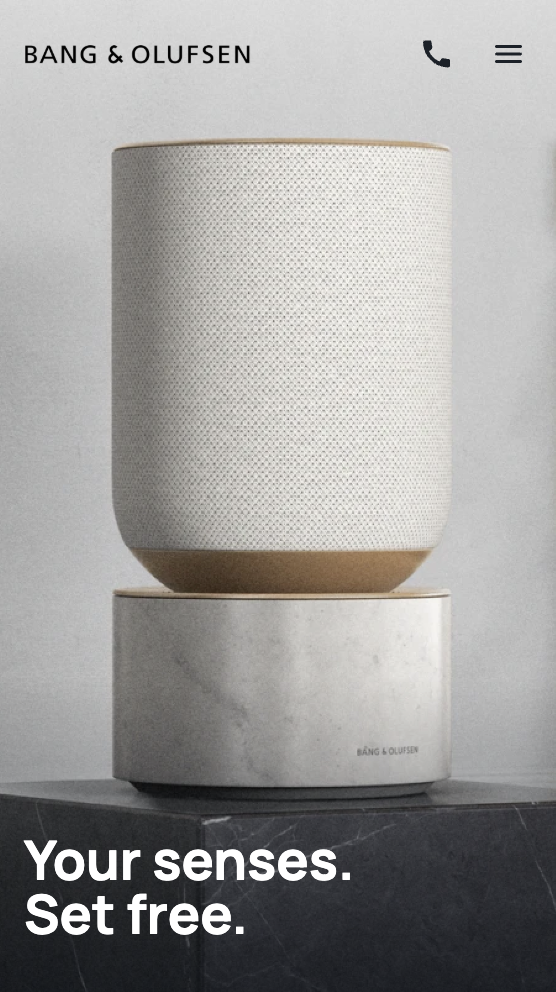

# B&O Landing Page

This is a responsive landing page for B&O, designed to provide an engaging and user-friendly interface.

## Table of contents

- [Overview](#overview)
  - [The challenge](#the-challenge)
  - [Getting started](#getting-started)
  - [Screenshot](#screenshot)
  - [Links](#links)
- [My process](#my-process)
  - [Built with](#built-with)

## Overview

### The challenge

Users should be able to:

- Add their email and submit the form
- See form validation messages if:
  - The field is left empty
  - The email address is not formatted correctly
- View the optimal layout for the interface depending on their device's screen size
- See hover and focus states for all interactive elements on the page
- Click on phone numbers links that initiate a call, and addresses link to Google Maps (open in a new tab).

### Getting Started

Prerequisites

To run this project locally, ensure you have the following installed:
-	Node.js: Version 14.x
- npm: Comes with Node.js (used for installing dependencies)
- Git: For cloning the repository

Installation
- 1. Clone the Repository
      git clone https://github.com/NKoshmak/BO-landing-page.git
- 2. Navigate to the Project Directory
      cd BO-landing-page
- 3. Install Dependencies
      npm install
- 4. Run the Project Locally
      npm start
- 5. Open your browser and navigate to http://localhost:3000.

### Screenshots

#### Desktop View

#### Mobile View

### Links

- [Solution URL](https://github.com/NKoshmak/BO-landing-page)
- [Live Site URL](https://nkoshmak.github.io/BO-landing-page/)

## My process

### Built with

- Semantic HTML5
- CSS/SASS
- Flexbox & Grid
- BEM Methodology
- Mobile-First Workflow

